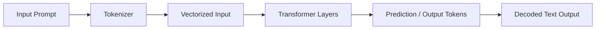
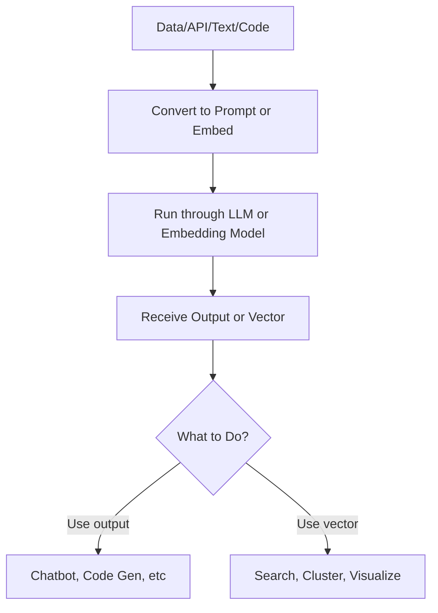

# AI for Dev 101

Welcome to **AI for Dev 101** — a no-fluff crash course to understand the *foundations of AI & LLMs* through the lens of a software engineer. Think of this as your glossary-meets-map before diving deeper into building or using AI.

---

## Key Building Blocks of Modern AI

Let’s translate the buzzwords into dev-speak:

| Term | In Dev Terms | Notes |
|------|--------------|-------|
| [**Model**](#model) | A trained function | Takes input, returns prediction |
| [**LLM**](#llm-large-language-model) | Autocomplete-on-steroids | Trained on code + natural language |
| [**Token**](#token) | A unit of text | Like a chunked string, not a char |
| [**Embedding**](#embedding) | A vector that “means” something | Used in search, similarity |
| [**Prompt**](#prompt) | The input you give the model | Like a dynamic query |
| [**Fine-tuning**](#fine-tuning) | Custom training | Give model new examples |
| [**RAG**](#rag-retrieval-augmented-generation) | Retrieval + Generation | Combine search engine + LLM |
| [**Inference**](#inference) | Running the model | Like calling a `.predict()` |
| [**Context Window**](#context-window) | Model memory span | Limited tokens it can “see” |
| [**Transformer**](#transformer) | The core architecture | Powers LLMs like GPT, BERT |

---

## LLM Mental Model (for Devs)



Think of it like:

Compiling → Running → Returning output

input → process → output but with statistical reasoning

---

## Common Workflows Using AI



This applies whether you're calling an OpenAI API, building with LangChain, or embedding search with Pinecone.

---

## As a Developer, Why Should You Care?
These terms show up everywhere in AI APIs

Understanding them makes docs make sense

They’re the entry point to building apps with LLMs

You can integrate AI with tools you already know: REST APIs, CLI tools, or data pipelines

---

## What’s Next?
If you’ve used an API before, you’re already halfway to using LLMs. Mastering these terms will unlock:

How to use OpenAI, HuggingFace, Azure AI

When to use RAG vs Fine-tuning

How to build smarter features into your apps

---

## Linked Concepts (For Deeper Dive)
Prompt Engineering

Embeddings & Vector DBs

Model Lifecycle

Inference Optimization

Training vs Fine-tuning

LLM Context Windows

---

## Summary
This course is your compass. As a dev, you don’t need to become a researcher — but if you want to speak AI fluently, this 101 gives you the mental model, glossary, and confidence to move forward.

## Reference

### <a name="llm-large-language-model"></a>LLM (Large Language Model)
An LLM is a specific kind of model trained on massive corpora of text. It learns statistical patterns in sequences of tokens to predict what comes next. It’s like:

```pseudo
next_token = LLM(previous_tokens)
```
But with billions of parameters. GPT-4, Claude, and PaLM are all examples of LLMs.

### <a name="token"></a>Token
Tokens are units of input the model understands — words are broken into tokens, and models process inputs in tokens. For example:

```text
"functionality" → ["function", "ality"]
```
Why it matters: All LLMs have token limits, and understanding tokens helps you craft better prompts.

### <a name="embedding"></a>Embedding
An embedding is a vector representation of text, designed so that similar meanings have similar vectors. You can use it for:
- Document similarity
- Search ranking
- Clustering

You don’t read embeddings directly — you use them in vector databases like FAISS, Pinecone, or Qdrant.

### <a name="prompt"></a>Prompt
A prompt is the input you feed into an LLM. Think of it as both your query and instructions:

```text
"Write a Python function that calculates Fibonacci numbers"
```
Prompt engineering is about structuring prompts for better results.

### <a name="fine-tuning"></a>Fine-tuning
Fine-tuning is training an existing model on your own task-specific data. Use this if:
- You have custom domain data
- You want the model to behave a certain way consistently

Fine-tuning is optional — many use cases work with prompt design + retrieval (see RAG).

### <a name="rag-retrieval-augmented-generation"></a>RAG (Retrieval-Augmented Generation)
RAG combines two systems:
- A retriever fetches relevant documents (via embeddings)
- An LLM generates output based on them

Great for:
- Knowledge bases
- Internal documentation
- Chatbots with source grounding

### <a name="inference"></a>Inference
Inference is just the term for “running the model” — turning input into output.
Think: production calls to `openai.ChatCompletion.create(...)`

### <a name="context-window"></a>Context Window
The context window is how much information the model can “remember” in a single prompt. GPT-4-turbo has up to 128k tokens (~300 pages). If your input + output exceed the window, it will get cut off.

### <a name="transformer"></a>Transformer
The Transformer architecture (from the paper "Attention Is All You Need") is what powers most modern LLMs. It introduced the “self-attention” mechanism — the model can focus on relevant parts of the input dynamically.

It replaced RNNs/LSTMs and allowed for massive parallelization during training.

### <a name="model"></a>Model
A model is a trained function that takes input and returns a prediction. In the context of AI, it refers to the mathematical structure that has learned from data to perform a specific task.
